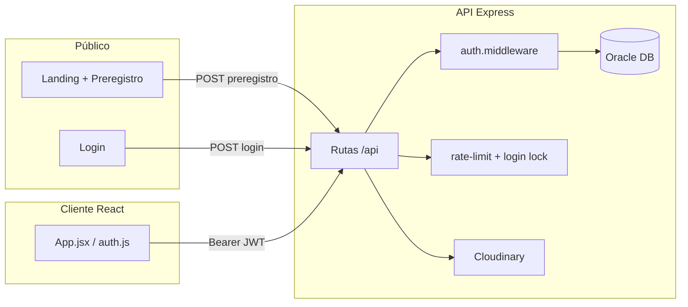

# AEBNL — Sistema de gestión

Plataforma web para la **Asociación Espina Bífida de Nuevo León (AEBNL)**. Integra sitio público, pre-registro de beneficiarios y panel operativo para el personal interno: beneficiarios, citas, servicios, inventario, recibos, donaciones y reportes analíticos.

---

## Contenido

- [Módulos](#módulos)
- [Stack tecnológico](#stack-tecnológico)
- [Arquitectura](#arquitectura)
- [Estructura del repositorio](#estructura-del-repositorio)
- [Requisitos](#requisitos)
- [Instalación y desarrollo local](#instalación-y-desarrollo-local)
- [Variables de entorno](#variables-de-entorno)
- [API REST](#api-rest)
- [Seguridad](#seguridad)

---

## Módulos

### Público (sin sesión)

- **Landing** — información de la asociación, testimonios, contacto y donaciones.
- **Pre-registro** — formulario para que familias soliciten alta de un beneficiario (`POST /api/preregistros`).
- **Login** — acceso al panel interno.

### Panel interno (requiere JWT)


| Módulo                | Ruta                                | Descripción                                                    |
| --------------------- | ----------------------------------- | -------------------------------------------------------------- |
| Dashboard             | `/dashboard`                        | Agenda del día, preregistros pendientes                        |
| Beneficiarios         | `/beneficiarios`                    | Búsqueda, consulta y edición                                   |
| Registro beneficiario | `/registro_beneficiario`            | Alta completa con datos médicos, dirección, foto               |
| Citas                 | `/citas`                            | Calendario y gestión de citas                                  |
| Servicios             | `/servicios`, `/registro_servicios` | Catálogo e historial de servicios otorgados                    |
| Inventario            | `/inventario`                       | Stock, categorías, movimientos                                 |
| Recibos               | `/recibos`                          | Consulta por día, mes o rango                                  |
| Donaciones            | `/donaciones`                       | Fondo de donaciones                                            |
| Reportes              | `/reportes/`*                       | General, mensual, anual, inventario, donaciones, personalizado |


---

## Stack tecnológico

### Frontend (`client/`)

- React 19 + Vite 7
- React Router 7
- Tailwind CSS 4
- FullCalendar, Recharts, GSAP, jsPDF
- PWA (vite-plugin-pwa)

### Backend (`server/`)

- Node.js + Express 5
- TypeScript
- Oracle Database (oracledb + wallet TLS)
- JWT (jsonwebtoken + bcryptjs)
- Zod (validación)
- Cloudinary (fotos de beneficiarios)
- express-rate-limit, helmet

---

## Arquitectura




**Capas del servidor**

```
routes/  →  handlers/  →  controllers/  →  repositories/  →  Oracle
                ↓
         middlewares/ (auth, validate, rate-limit, upload)
```

---

## Estructura del repositorio

```
reto-aebnl/
├── client/                 # Frontend React (Vite)
│   ├── src/
│   │   ├── pages/          # Pantallas por módulo
│   │   ├── components/     # UI y layout
│   │   ├── hooks/          # Lógica reutilizable
│   │   ├── services/       # Llamadas API
│   │   └── utils/          # auth, config, fechas
│   └── package.json
├── server/                 # Backend Express + TypeScript
│   ├── index.ts            # Punto de entrada
│   └── src/
│       ├── routes/
│       ├── handlers/
│       ├── controllers/
│       ├── repositories/
│       ├── middlewares/
│       ├── schemas/        # Validación Zod
│       ├── utils/
│       └── db/oracle.ts
├── netlify.toml            # Deploy del frontend
├── .github/workflows/      # SonarCloud
└── README.md
```

---

## Requisitos

- **Node.js** 18+ (helmet 8 exige 18+)
- **npm** 9+
- Acceso a **Oracle Cloud** (credenciales + carpeta wallet, ej. `Wallet_clasedb/`)
- Cuenta **Cloudinary** (subida de fotografías)
- `server/.env` configurado (ver [Variables de entorno](#variables-de-entorno))

---

## Instalación y desarrollo local

### 1. Clonar e instalar dependencias

```bash
git clone <url-del-repo>
cd reto-aebnl

# Backend
cd server
npm install

# Frontend
cd ../client
npm install
```

### 2. Configurar variables de entorno

Crear `server/.env` con las variables de la tabla inferior. 

### 3. Arrancar el backend

```bash
cd server
npm run dev
```

### 4. Arrancar el frontend

```bash
cd client
npm run dev
```

---

## Variables de entorno

### Servidor (`server/.env`)


| Variable                 | Req. | Descripción                                   |
| ------------------------ | ---- | --------------------------------------------- |
| `ORACLE_USER`            | Sí   | Usuario Oracle                                |
| `ORACLE_PASSWORD`        | Sí   | Contraseña Oracle                             |
| `ORACLE_CONNECT_STRING`  | Sí   | Alias TNS (ej. `database_high`)               |
| `ORACLE_WALLET_PASSWORD` | Sí   | Contraseña del wallet                         |
| `TNS_ADMIN`              | Sí   | Ruta carpeta wallet (ej. `./Wallet_database`) |
| `ORACLE_TNS_ADMIN`       | No   | Misma ruta que `TNS_ADMIN` (convención local) |
| `ORACLE_WALLET_PATH`     | No   | Misma ruta que `TNS_ADMIN` (convención local) |
| `JWT_SECRET`             | Sí   | Secreto para firmar tokens                    |
| `JWT_EXPIRES_IN`         | No   | Expiración JWT (ej. `1h`)                     |
| `CLOUDINARY_CLOUD_NAME`  | Sí   | Cloudinary                                    |
| `CLOUDINARY_API_KEY`     | Sí   | Cloudinary                                    |
| `CLOUDINARY_API_SECRET`  | Sí   | Cloudinary                                    |
| `PORT`                   | No   | Puerto HTTP                                   |
| `WALLET_BASE64`          | No*  | Solo deploy                                   |


---

## API REST

Prefijo base: `/api`

### Autenticación


| Método | Ruta               | Auth | Descripción                          |
| ------ | ------------------ | ---- | ------------------------------------ |
| `POST` | `/usuarios/login`  | No   | Inicio de sesión → `{ user, token }` |
| `POST` | `/usuarios/logout` | JWT  | Revoca el token actual               |


### Público limitado


| Método | Ruta            | Descripción                       |
| ------ | --------------- | --------------------------------- |
| `POST` | `/preregistros` | Crear pre-registro (rate-limited) |


### Staff (`administrador` / `operador`)

Requieren header `Authorization: Bearer <token>`:

- `/beneficiarios/`* — CRUD y datos relacionados
- `/preregistros` (GET) — listar y consultar
- `/citas` — agenda
- `/recibos/`* — recibos y resúmenes
- `/inventario/`* — inventario
- `/dashboard/*` — agenda hoy, preregistros pendientes
- `/registro_servicios/*`, `/servicios/*`
- `/fondo_donaciones/*`
- `/reportes/analytics/*`
- `/especialistas`, `/catalogo-servicios`, `/buscar-beneficiarios`

### Respuestas de error

Formato estándar:

```json
{
  "message": "Descripción del error",
  "code": "UNAUTHORIZED",
  "details": {}
}
```

Códigos comunes: `VALIDATION_ERROR`, `UNAUTHORIZED`, `FORBIDDEN`, `NOT_FOUND`, `CONFLICT`, `TOO_MANY_REQUESTS`.

---

## Seguridad

Medidas implementadas en el API:


| Medida                      | Detalle                                                        |
| --------------------------- | -------------------------------------------------------------- |
| **Rate limit login**        | 5 intentos fallidos por IP / 15 min (`skipSuccessfulRequests`) |
| **Bloqueo por usuario**     | 5 contraseñas incorrectas → cuenta bloqueada 15 min            |
| **Rate limit preregistro**  | 5 envíos por IP / hora                                         |
| **JWT con revocación**      | `jti` en blacklist al hacer logout                             |
| **Helmet**                  | Headers HTTP de seguridad en todas las respuestas              |
| **CORS**                    | Orígenes permitidos explícitos (localhost + Netlify)           |
| **Auth en rutas sensibles** | Recibos, citas, catálogos, lectura de preregistros             |
| **Logs Oracle**             | Solo en desarrollo (`NODE_ENV !== 'production'`)               |
| **Trust proxy**             | IP real detrás de reverse proxy (Render, etc.)                 |


---

## Licencia y contacto

Proyecto académico / institucional para AEBNL. Para dudas operativas, contactar al equipo de desarrollo o a la asociación.